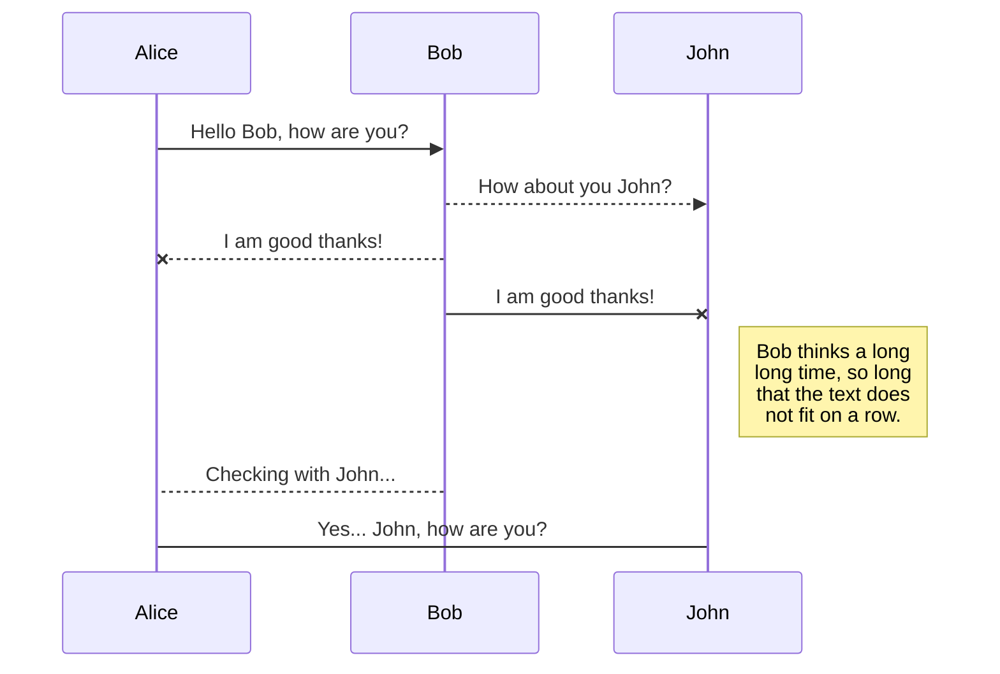

### Headers

### Hardline

---

### CheckList

Consectetur adipiscing elit

- [x] Checked task item
- [x] Another checked task item
- [ ] Unchecked task item

### Emoji

:apple:

Can be also be used :fire: inline

### Strikethrough

Lorem ~~ipsum~~ dolor

### Subscript

Lorem ^ipsum^ dolor

### Font Styling

Lorem _ipsum_ dolor

Lorem **ipsum** dolor

### Blockquotes

> Lorem ipsum dolor sit amet
> Consectetur adipiscing elit

### Ordered Lists

1. Lorem ipsum dolor sit amet
1. Consectetur adipiscing elit
1. Morbi vehicula aliquam

### InlineCode

Lorem `ipsum` dolor

### CodeBlock

```
function lorem (ipsum) {
    const dolor = 'consectetur adipiscing elit'
}
```

### Images


### Links

[Lorem ipsum](https://wiki.js.org/about)

Consectetur [adipiscing](/install/requirements) elit

### KeyboardKeys

Lorem ipsum dolor <kbd>CTRL</kbd> + <kbd>C</kbd>

### Footnotes

This sentence[^1] needs a few footnotes.[^2]

[^1]: A string of syntactic words.
[^2]: A useful example sentence.

### PlantUML Diagrams

```plantuml
Bob->Alice : hello
```

### Mermaid Diagrams


